# Deep Neural Network Based Fault Classification and Location Detection in Power Transmission Lines

**Authors:** Pranav Bali (2021EEB1193), Shashwat Srivastava (2021EEB1210)

**Institution:** Department of Electrical Engineering, Indian Institute of Technology Ropar

**Date:** April 24, 2025

## Overview

This project investigates the application of Deep Neural Networks (DNNs) for automated fault classification and fault location in power transmission lines. Using data generated from a simulated 4-bus system in MATLAB/Simulink, this study aims to develop models that can quickly and accurately identify fault types (Line-to-Ground (LG), Line-to-Line (LL), Double Line-to-Ground (LLG), Three-Phase (LLL), or No Fault) and estimate the location of these faults. The DNN models developed demonstrate high accuracy, especially in classification (over 96% with 2% noise), showcasing their potential to enhance power system reliability and operational efficiency.

## Introduction

Reliable power systems are essential for modern society. Transmission line faults, such as short circuits, can cause significant disruptions, leading to power outages and equipment damage. Traditional methods for fault detection, classification, and location can be slow or imprecise. Deep Learning, particularly DNNs, offers a promising data-driven alternative by learning complex patterns from voltage and current data recorded during faults. This project explores the use of DNNs to improve grid resilience through faster and more accurate responses to transmission line faults, utilizing readily available RMS measurements.

## Simulation Setup

A 4-bus power system was modeled in MATLAB/Simulink (Simscape Electrical) to generate the fault data.
*   **System:** 4 buses (2 generator buses, 2 load buses).
*   **Transmission Lines:** Three 100 km, 11 kV lines.
*   **Loads:** Connected at buses 2, 3, and 4 (10 MW, 15 MW, 5 MW).
*   **Fault Simulation:** Fault simulators on each line are used to generate various fault types (LG, LL, LLG, LLL) at different locations and with varying fault resistances.

*(For a detailed diagram of the Simulink model, please refer to Figure 1 in the project report or presentation.)*

## Dataset Generation

A comprehensive dataset was created to cover various fault scenarios:
*   **Features (Inputs):**
    *   RMS values of 3-phase voltages (Va, Vb, Vc) and currents (Ia, Ib, Ic).
    *   Measurements taken at the sending end of each line over one post-fault cycle (40 samples at 2000 Hz).
    *   For location models, the average RMS value over this cycle was used (total of 6 features).
*   **Targets (Outputs):**
    *   **Classification:** Fault type (LG, LL, LLG, LLL, None - one-hot encoded).
    *   **Location:** Distance in km from the sending bus (0-100 km).
*   **Scenarios per Line:** Faults were simulated at 17 locations (5 km spacing) on each line, for 4 fault types, and 8 different fault resistances.
*   **Dataset Size:**
    *   **Classification:** 2040 samples.
    *   **Location:** 544 samples per line (excluding 'No Fault' instances).

## Data Analysis

Exploratory data analysis provided insights into the characteristics of the dataset.

*   **Raw Feature Distribution:** Currents generally show sharper peaks, while voltages exhibit broader distributions, indicating variability crucial for model learning. Outliers are present.

    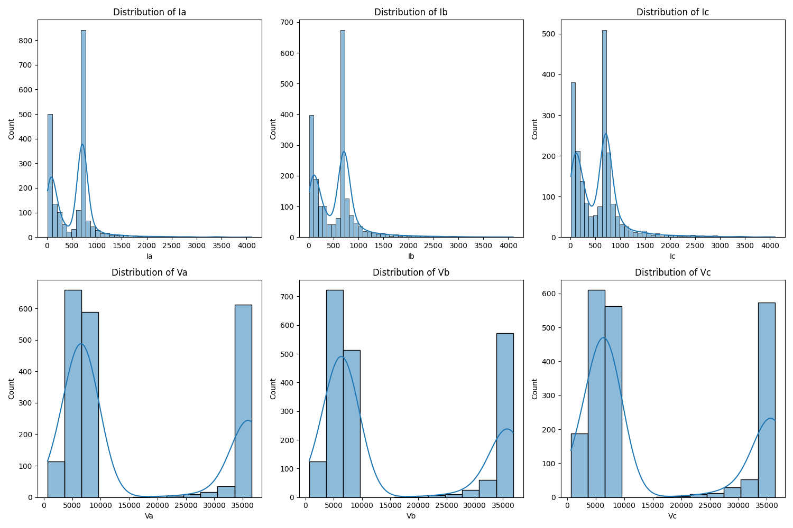

*   **Effect of Noise:** Adding 5% noise to the features (e.g., current `Ia`) introduces variability but preserves the basic structural distribution, suggesting potential for model resilience while highlighting the need for robustness testing.

    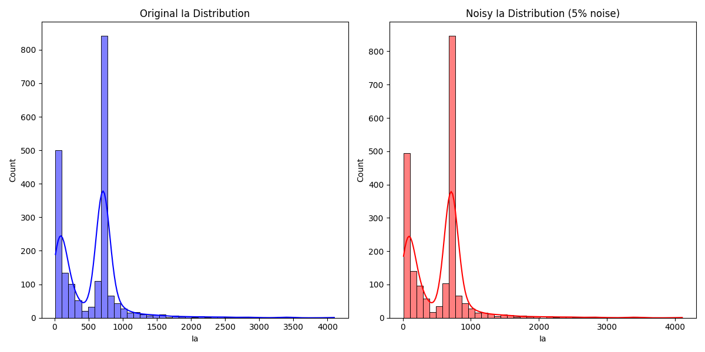

*   **Feature Correlation:** Strong correlations exist within voltage groups and current groups, with moderate correlations between voltage and current features. This indicates that features provide both overlapping and unique information.

    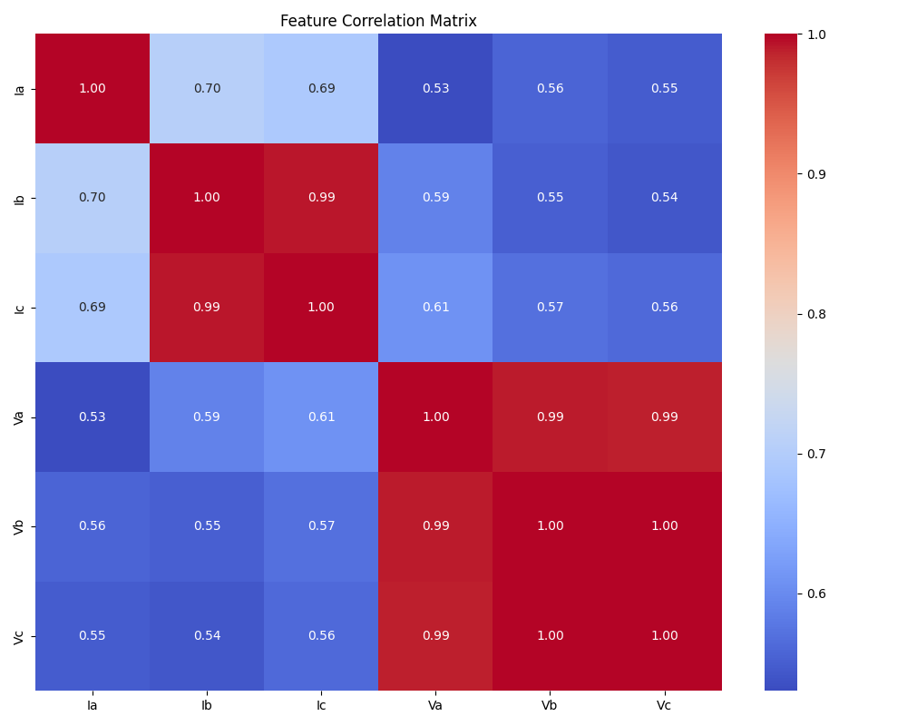

*   **Feature Importance (for Classification):** All six input features (Va, Vb, Vc, Ia, Ib, Ic) contribute significantly to the classification task, with Vb and Ib being the most influential according to first layer weights.

    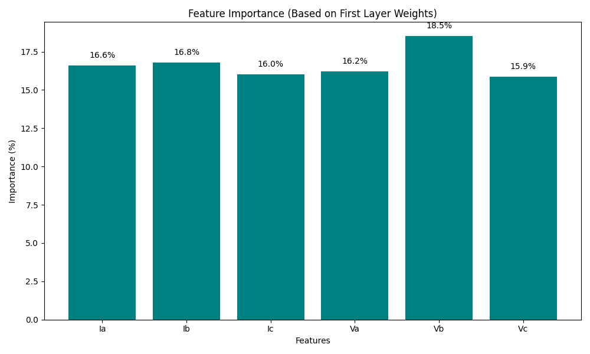

*   **Target Distribution:** This visualization shows the distribution of the target variables (e.g., fault types for classification).

    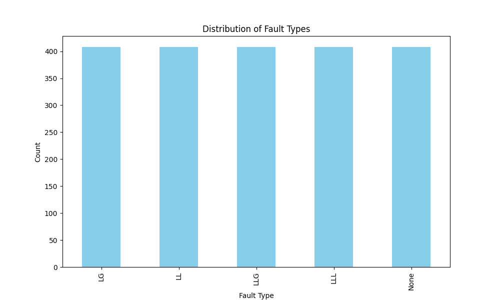

## Fault Classification Model

A Deep Neural Network (DNN) was designed for fault type classification.

### Model Architecture

The model utilizes a feedforward neural network structure:
*   **Input:** 6 neurons (corresponding to the 6 RMS features).
*   **Hidden Layers:**
    *   Hidden 1: 60 neurons with ReLU activation.
    *   Batch Normalization.
    *   Hidden 2: 100 neurons with ReLU activation.
    *   Hidden 3: 50 neurons with ReLU activation.
*   **Output Layer:** 5 neurons (for 5 fault classes) with Softmax activation.
*   **Optimizer:** Adam.
*   **Loss Function:** Categorical Cross-Entropy.

*(For a graphical representation of the architecture, see Figure 6 in the project report.)*

### Performance and Visualizations

The classification model demonstrated strong performance, even with 2% noise added to the test set.
*   **Accuracy:** 96.23%
*   **Precision (Macro):** 0.9086
*   **Recall (Macro):** 0.9020
*   **F1-Score (Macro):** 0.9053
*   **Matthew's Correlation Coefficient (MCC):** 0.8817
*   **AUROC (OvR Macro):** 0.9867

*   **Learning Curves:** The training and validation loss/accuracy curves converge closely, indicating good generalization without significant overfitting. The optimal point is reached relatively early in training.

    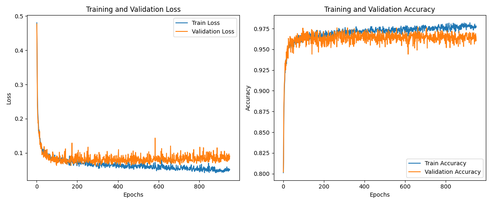

*   **Confusion Matrix:** High diagonal values in the confusion matrix confirm the model's accuracy. Minor confusion occurs between similar fault types like LL and LLG. (The original study reported 98.775% overall accuracy without added noise).

    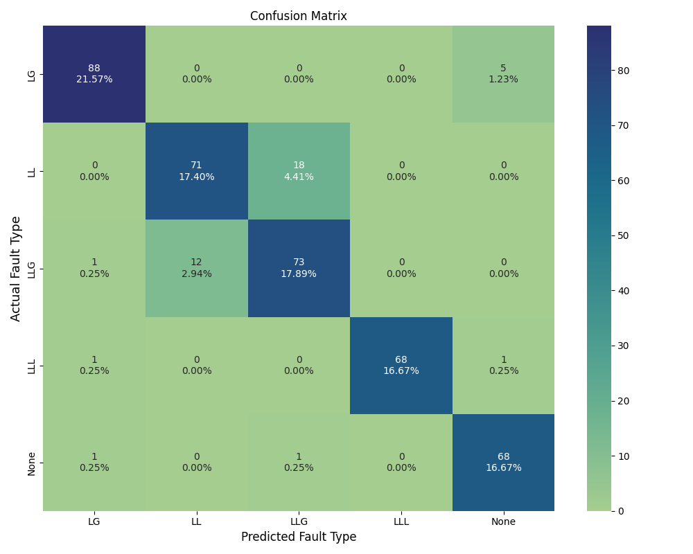

*   **Per-Class Accuracy:** The model achieves high accuracy (>92%) across all individual fault types, demonstrating balanced and reliable performance.

    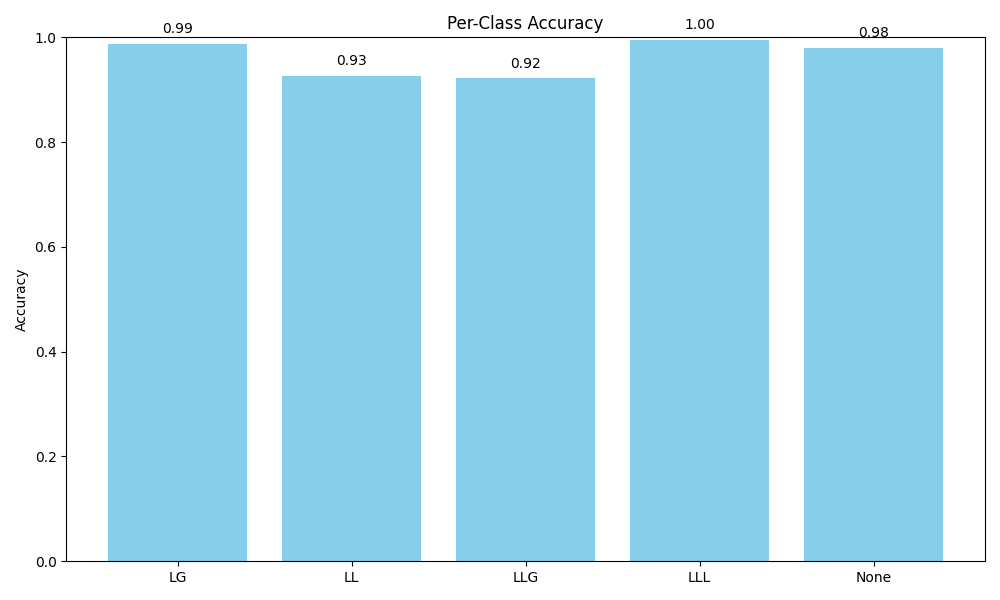

*   **ROC Curves:** High Area Under Curve (AUC) values (close to 1.0) for all classes (One-vs-Rest) confirm the excellent discriminative ability of the model.

    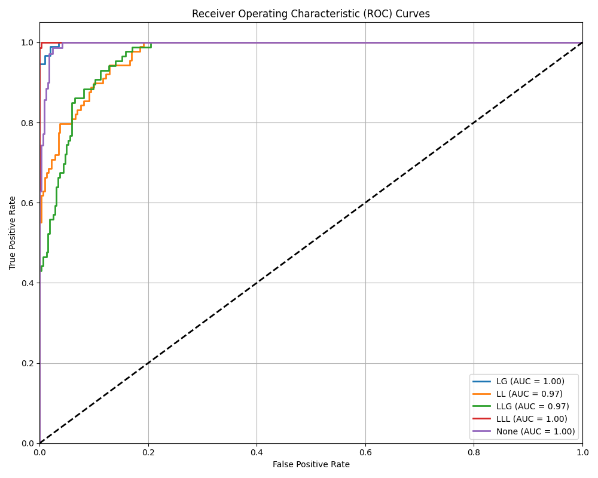

*   **Prediction Confidence:** This visualization likely shows the confidence levels of the model's predictions.

    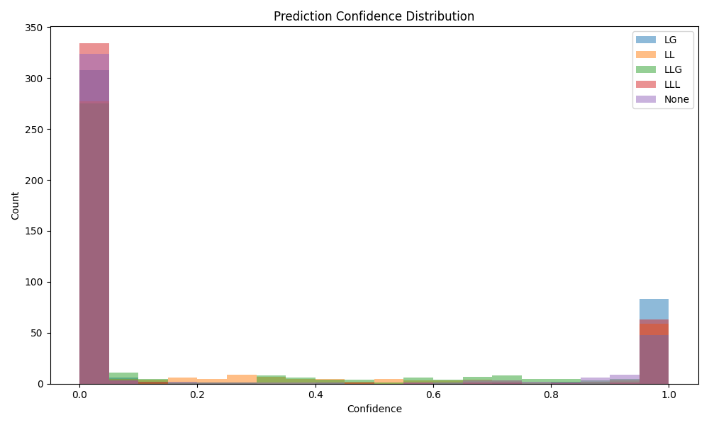

*   **Correct vs. Incorrect Predictions:** This visualization helps in understanding where the model performs well versus where it makes errors.

    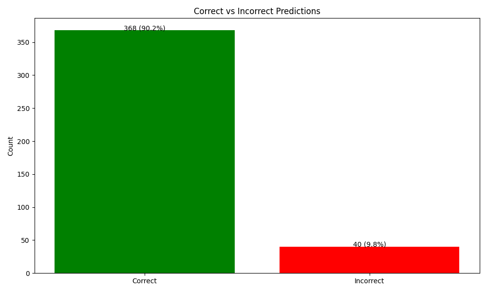

## Comparison with Classical ML Models

The DNN classifier was compared against standard Machine Learning algorithms for the fault classification task. The DNN significantly outperformed classical models such as K-Nearest Neighbors (KNN), Random Forest (RF), Decision Tree (DT), Support Vector Machine (SVM), and Logistic Regression (LR), highlighting the advantage of deep learning for this complex task.

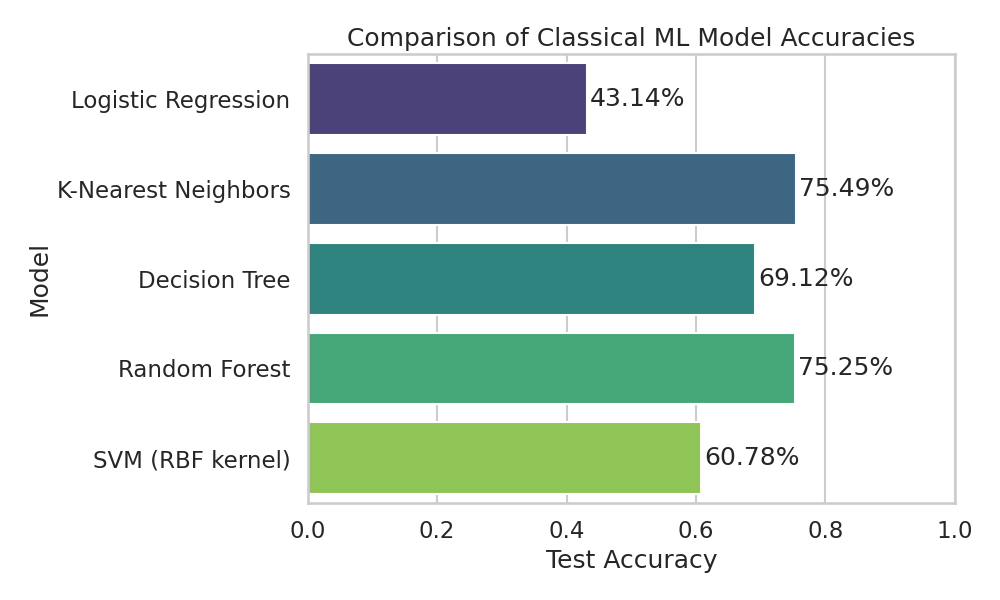

## Fault Location Model

Separate DNNs were trained to estimate the fault location (distance in km) for each line, using the 6 RMS voltage and current features as input. Two architectures were explored:

1.  **Baseline Model:** A standard Multi-Layer Perceptron (MLP) with batch normalization and mixed activation functions (ReLU/Tanh).
    *(Architecture details in Figure 12 of the project report.)*
2.  **CNN+LSTM+Transformer Model:** A hybrid architecture designed to capture different aspects of the input features (spatial features with 1D CNN, sequential dependencies with LSTM, and feature importance with a Transformer Encoder).
    *(Architecture details in Figure 15 of the project report.)*

### Performance Comparison

The performance of the two location models was evaluated on the test set. The CNN+LSTM+Transformer model consistently, though modestly, outperformed the Baseline MLP model across various metrics.

| Metric                      | Baseline MLP | CNN+LSTM+Transformer |
| :-------------------------- | :----------- | :------------------- |
| MAE (km)                    | 12.1713      | **11.9852**          |
| MSE (km²)                   | 309.2017     | **276.4286**         |
| RMSE (km)                   | 17.5841      | **16.6261**          |
| R² Score                    | 0.4291       | **0.4896**           |
| Accuracy within 5km (5%)    | 14.63%       | **17.07%**           |
| Accuracy within 10km (10%)  | 34.15%       | **35.37%**           |
| Mean Relative Error (%)     | 38.37%       | **35.80%**           |

*(Loss curves and prediction vs. true value plots for these models can be found in Figures 13, 14, 16, and 17 of the project report.)*

The improvement, while consistent, is relatively small, suggesting that estimating the exact location from only sending-end RMS values is inherently challenging or requires further model refinement and potentially more informative features.

## Proposed Robust Model (CNN + LSTM + Transformer)

The CNN+LSTM+Transformer architecture, evaluated for location estimation, represents an approach towards robustness. It offered modest improvements over the baseline MLP. The rationale includes:
*   **CNNs:** Extract spatial features potentially robust to noise.
*   **LSTMs:** Model sequence dynamics (even if limited with averaged RMS).
*   **Transformers:** Focus attention on important features.

While the performance gain was not dramatic in this study, this hybrid approach provides a foundation.

## Limitations

*   **Simulation Data Only:** Lack of validation on real-world measurements.
*   **Limited Scope:** The study was based on a specific system topology and a defined set of fault types. RMS features might limit precision for location.
*   **Implementation Aspects Ignored:** Real-time constraints (latency, computation) were not addressed.
*   **Location Accuracy:** While the hybrid model improved location estimation, the overall accuracy requires significant enhancement for practical deployment (e.g., ~35% of predictions within 10km of the actual fault).

## Future Work

*   Validate models on real-world data.
*   Test on larger, more complex networks and other fault types (e.g., High Impedance Faults - HIFs).
*   Systematically study and improve noise robustness (e.g., using advanced architectures, data augmentation).
*   Investigate using raw waveform data or time-series features instead of just RMS values for potentially higher location accuracy.
*   Explore multi-ended measurement approaches.
*   Investigate real-time implementation feasibility.

## Conclusion

This project demonstrated the viability of DNNs for transmission line fault classification and location using simulated data.
*   **Fault Classification:** The DNN model was highly accurate (>96% accuracy with noise), significantly outperforming traditional machine learning algorithms.
*   **Fault Location:** A CNN+LSTM+Transformer hybrid model consistently, but not strongly, outperformed a baseline MLP model, achieving a Mean Absolute Error (MAE) of around 12 km and an R² score of approximately 0.49.
However, the accuracy of location estimation remains a challenge, with relatively low precision within close error margins (e.g., about 35% of predictions fall within 10 km of the actual fault).

Although restricted by simulation data and the use of RMS features, the outcomes strongly support DNNs as valuable tools for enhancing fault analysis in power systems, especially for classification. Subsequent research should emphasize real-world validation, using more informative features (such as time-series data), and enhancing model robustness and accuracy, particularly for location estimation, to bridge the gap toward practical deployment and contribute to more reliable and efficient grid operation.

## Repository Structure

This repository contains the code and results for the project. Key directories include:
*   `Code/`
    *   `Classification_model.py`
    *   `Distance_model.py`
    *   `ML_Algo.py` (for comparison purposes)
*   `results/visualizations/`: Contains PNG images of various visualizations for the fault classification task (DNN based).
*   `results_ML/visualizations/`: Contains PNG images comparing DNN performance with classical ML models for classification.
*   *(Other directories might include data and notebooks used for the project.)*
